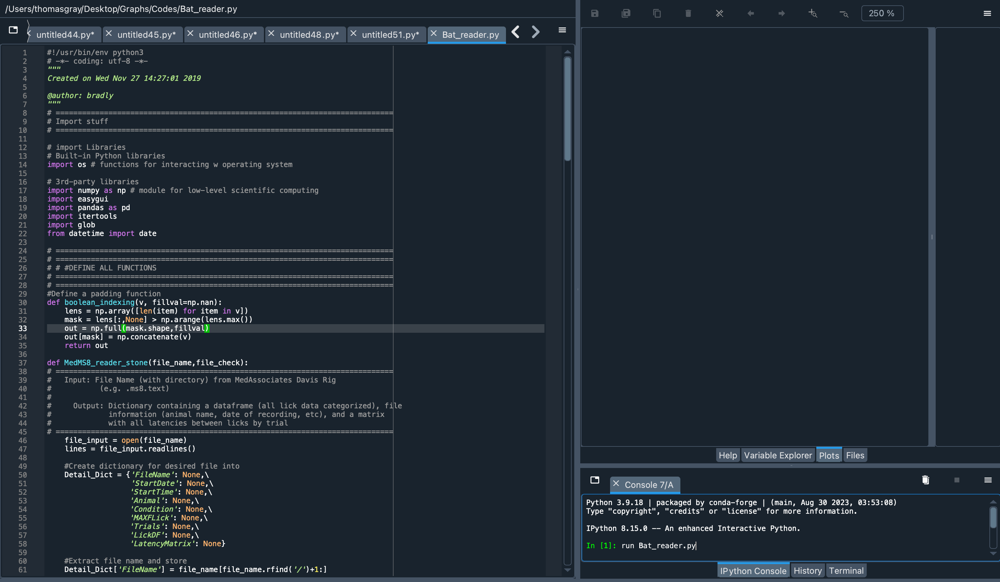

# Data Analysis

This section covers the steps and file structure required to analyze data using the `BAT_reader.py` script.

## Overview

The `BAT_reader.py` script is designed to read `.ms8.txt` files from the MedAssociates Davis Rig, extract relevant data, and generate a structured dataframe. This dataframe can then be used for further analysis, such as calculating lick counts, latency to lick, and identifying licking bouts.

## Instructions for BAT_reader.py

### 1. Data Preparation

- **File Requirements:**
  - `.ms8.txt` files: These are the raw data files from the Davis Rig.
  - Input file: A tab-separated text file (`.txt`) that contains experimental details such as the animal ID, date of experiment, condition, and notes.
  
- **Folder Organization:**
  It is important to organize your data files and the input file in the following structure:

  <button class="copy-button" onclick="copyCode('folder-organization')">Copy</button>
  <pre><code id="folder-organization">
  input_files/
    └─ input_data.txt
  
  data/
    ├─ 0129TG100_pretest.ms8.txt
    ├─ 0129TG101_pretest.ms8.txt
    ├─ 0129TG102_pretest.ms8.txt
    └─ 0129TG103_pretest.ms8.txt
  </code></pre>

### 2. Input File Format

The input file, which should be placed in the `input_file/` folder, must be formatted exactly as follows:

  <button class="copy-button" onclick="copyCode('input-file-format')">Copy</button>
  <pre><code id="input-file-format">
Animal   Date       Condition   Notes
TG100    2024/01/29 E           Con1
TG101    2024/01/29 U           Con1
TG102    2024/01/29 E           Con1
TG103    2024/01/29 U           Con1
  </code></pre>

Make sure the dates and names in the input file match those in the `.ms8.txt` files exactly.

### 3. Running BAT_reader.py

1. Place all `.ms8.txt` files into the `data/` folder.
2. Ensure the input file is correctly formatted and located in the `input_files/` folder.
3. Run the `BAT_reader.py` script. When prompted:

  <button class="copy-button" onclick="copyCode('folder-organization')">Copy</button>
  <pre><code id="folder-organization">
  run BAT_reader.py
  </code></pre>

   - Select the `ms8_data/` folder for your data files.
   - Select the `input_files/` folder for your input file.
4. The script will process the data and output a dataframe.

### 4. Data Output

Once processed, the data will be organized into a dataframe that includes the following:
- Lick data categorized by trial
- Latency between licks
- Bout structure (licks grouped based on a defined criterion, e.g., a pause of 500 ms between licks)
  
The processed data will be saved in a file named `grouped_dframe.df`, timestamped with the current date.

## Additional Information

The `Stink_Bat/` folder on the google drive contains basic plotting code for visualizing the data stored in the dataframe. You can customize these plots to suit your experimental needs.

<!-- JavaScript -->

<!-- CSS -->

