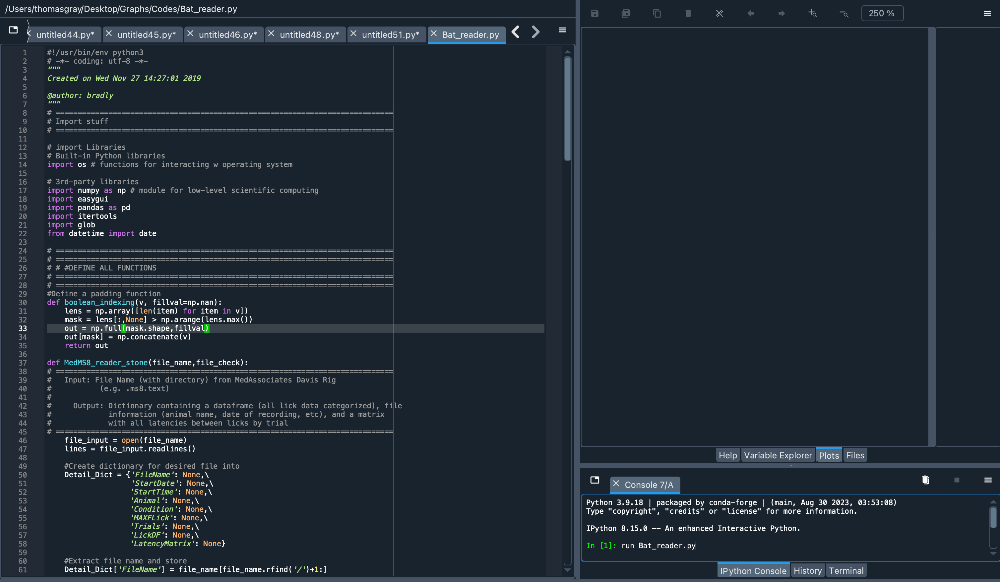

# Data Analysis

This section covers the steps and file structure required to analyze data using the `BAT_reader.py` script.

## Overview

# Understanding the Data

## Sample Data File:

The top portion of the file shows:
- **File path and name**: `C:\DavisData\1030AB35.ms8.txt`
- **Version**: `7.29.00`
- **System ID**: `1`
- **Experiment start date**: `2020/10/13`
- **Start time**: `12:06:48`
- **Animal ID**: `AB35`
- **Max wait time for first lick**: `60` seconds
- **Max retries per presentation**: `0`
- **Max number of presentations**: `10`

---

## Data Columns:

The middle portion contains details for each presentation:

| PRESENTATION | TUBE | CONCENTRATION | SOLUTION | IPI (s) | LENGTH (s) | LICKS | LATENCY (ms) | RETRIES | OPEN ERROR | CLOSE ERROR |
|--------------|------|---------------|----------|---------|------------|-------|--------------|---------|------------|-------------|
| 1            | 4    | 0.3           | suc      | 7.5     | 5          | 1     | 7378         | 0       | 0          | 0           |
| 2            | 5    | 0.6           | suc      | 7.5     | 5          | 27    | 1565         | 0       | 0          | 0           |
| 3            | 6    | 1.0           | suc      | 7.5     | 5          | 4     | 18784        | 0       | 0          | 0           |
| 4            | 3    | 0.1           | suc      | 7.5     | 5          | 27    | 1573         | 0       | 0          | 0           |
| 5            | 1    | —             | water    | 7.5     | 5          | 27    | 1467         | 0       | 0          | 0           |
| 6            | 2    | 0.03          | suc      | 7.5     | 5          | 20    | 3793         | 0       | 0          | 0           |
| 7            | 3    | 0.1           | suc      | 7.5     | 5          | 23    | 2038         | 0       | 0          | 0           |
| 8            | 1    | —             | water    | 7.5     | 5          | 6     | 9726         | 0       | 0          | 0           |
| 9            | 4    | 0.3           | suc      | 7.5     | 5          | 21    | 1071         | 0       | 0          | 0           |
| 10           | 2    | 0.03          | suc      | 7.5     | 5          | 26    | 4993         | 0       | 0          | 0           |

### Column Descriptions:

- **PRESENTATION**: Trial number
- **TUBE**: Tube number presented (1–16)
- **CONCENTRATION**: Solution concentration presented in the tube
- **SOLUTION**: The liquid in the tube (e.g., sucrose (suc), water)
- **IPI (Inter-Presentation Interval)**: Time in seconds between tube presentations
- **LENGTH**: Duration in seconds of the tube presentation
- **LICKS**: Number of licks recorded during the trial
- **LATENCY**: Time in milliseconds from the start of the trial to the first lick
- **RETRIES**: Number of retries (when no lick is detected) during the trial
- **OPEN ERROR**: Errors when opening the shutter
- **CLOSE ERROR**: Errors when closing the shutter

---

## Inter-Lick Interval (ILI) Data:

The bottom portion of the file shows the **Inter-Lick Intervals (ILI)** for each presentation. The format is:
- **PRESENTATION number**: First number on the line.
- **ILI values**: Remaining numbers represent the intervals between licks in milliseconds.

### Example Breakdown:

- **Trial 1**: Only 1 lick, so no ILI is listed.
- **Trial 2**: 27 licks recorded, meaning 26 ILI values are listed.
- **Trial 3**: 4 licks recorded, so 3 ILI values are listed.

---

This format helps explain the contents of the sample data file generated by the Davis Rig.

The `BAT_reader.py` script is designed to read `.ms8.txt` files from the MedAssociates Davis Rig, extract relevant data, and generate a structured dataframe. This dataframe can then be used for further analysis, such as calculating lick counts, latency to lick, and identifying licking bouts.

## Instructions for BAT_reader.py

### 1. Data Preparation

- **File Requirements:**
  - `.ms8.txt` files: These are the raw data files from the Davis Rig.
  - Input file: A tab-separated text file (`.txt`) that contains experimental details such as the animal ID, date of experiment, condition, and notes.
  
- **Folder Organization:**
  It is important to organize your data files and the input file in the following structure:

  <button class="copy-button" onclick="copyCode('folder-organization')">Copy</button>
  <pre><code id="folder-organization">
  input_files/
    └─ input_data.txt
  
  data/
    ├─ 0129TG100_pretest.ms8.txt
    ├─ 0129TG101_pretest.ms8.txt
    ├─ 0129TG102_pretest.ms8.txt
    └─ 0129TG103_pretest.ms8.txt
  </code></pre>

### 2. Input File Format

The input file, which should be placed in the `input_file/` folder, must be formatted exactly as follows:

  <button class="copy-button" onclick="copyCode('input-file-format')">Copy</button>
  <pre><code id="input-file-format">
Animal   Date       Condition   Notes
TG100    2024/01/29 E           Con1
TG101    2024/01/29 U           Con1
TG102    2024/01/29 E           Con1
TG103    2024/01/29 U           Con1
  </code></pre>

Make sure the dates and names in the input file match those in the `.ms8.txt` files exactly.

### 3. Running BAT_reader.py

1. Place all `.ms8.txt` files into the `data/` folder.
2. Ensure the input file is correctly formatted and located in the `input_files/` folder.
3. Run the `BAT_reader.py` script. When prompted:

  <button class="copy-button" onclick="copyCode('folder-organization')">Copy</button>
  <pre><code id="folder-organization">
  run BAT_reader.py
  </code></pre>

   - Select the `ms8_data/` folder for your data files.
   - Select the `input_files/` folder for your input file.
4. The script will process the data and output a dataframe.

### 4. Data Output

Once processed, the data will be organized into a dataframe that includes the following:
- Lick data categorized by trial
- Latency between licks
- Bout structure (licks grouped based on a defined criterion, e.g., a pause of 500 ms between licks)
  
The processed data will be saved in a file named `grouped_dframe.df`, timestamped with the current date.

## Additional Information

The `Stink_Bat/` folder on the google drive contains basic plotting code for visualizing the data stored in the dataframe. You can customize these plots to suit your experimental needs.

<!-- JavaScript -->

<!-- CSS -->

