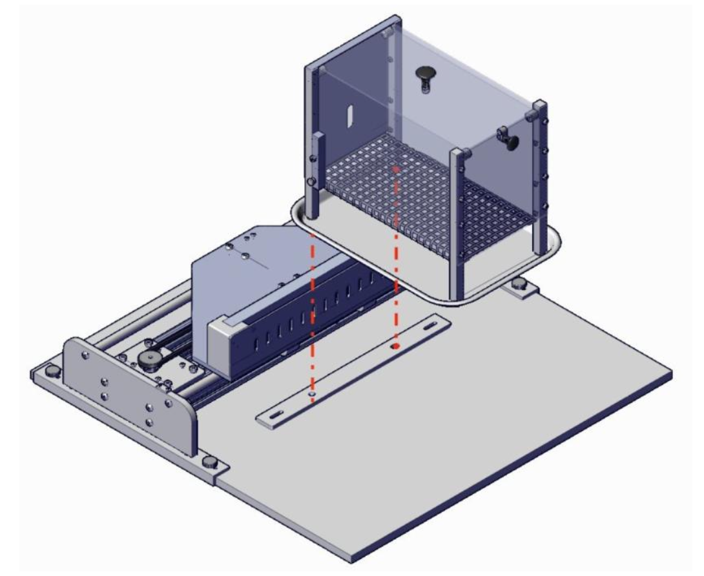
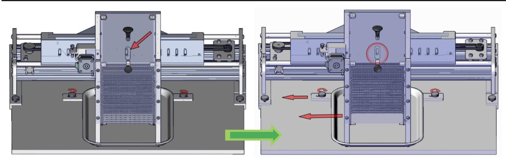
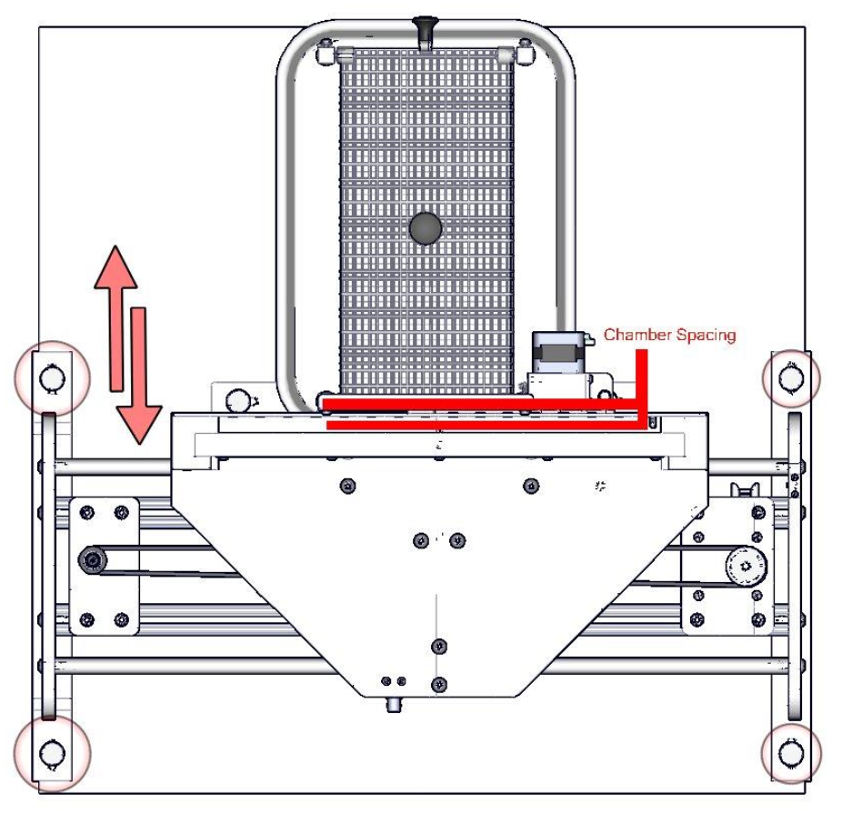
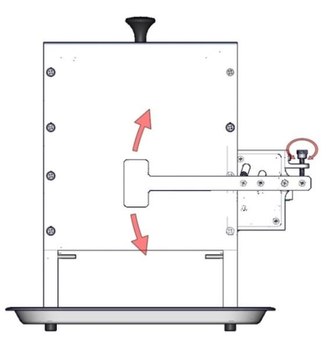
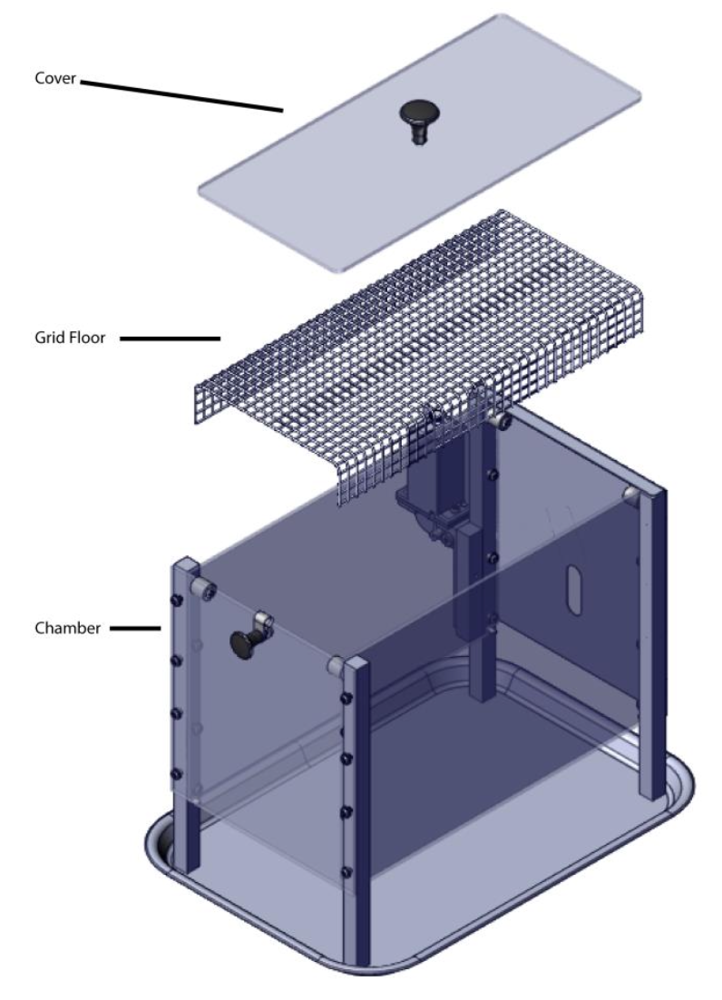

# Chapter 2 | Hardware

## Chamber Installation
Attach the chamber to the Davis Rig platform by aligning the chamber’s front feet with the chamber mounting guide holes on the platform.

## Bottle Installation
Install up to 16 bottles into their desired lick block locations.

## Chamber Alignment
To align the chamber with the lick block faceplate:
1. Loosen the 2 thumbscrews on the chamber mounting guide.
2. Slide the mounting guide and chamber until the lick block hole is centered in the chamber access hole.
3. Retighten the thumbscrews to secure placement.

## Chamber Spacing
To adjust the spacing between the chamber and lick block:
1. Loosen the 4 thumbscrews.
2. Move the carriage towards the chamber to reduce space or away to increase space.
3. Retighten the thumbscrews to secure.

## Access Door Position
To adjust the access door so it doesn’t completely close:
1. Turn the thumbscrew clockwise to raise the door.
2. Turn counterclockwise to lower the door.

## Access Door Removal
To remove the door assembly for cleaning:
1. Remove the thumbscrew.
2. Lift the assembly off the mounting stud.

## Grid Floor Installation/Removal
1. Gently pull the chamber top release knob.
2. Remove the chamber top and grid floor.
3. Reinstall the desired floor and replace the chamber top.

## Cleaning and Maintenance
For optimal performance:
- Wipe off spills or drips, especially with sticky solutions like sucrose.
- Regularly clean the table, lick block, faceplate, and rods.

---

*Copyright © 2020 Med Associates, Inc.*

